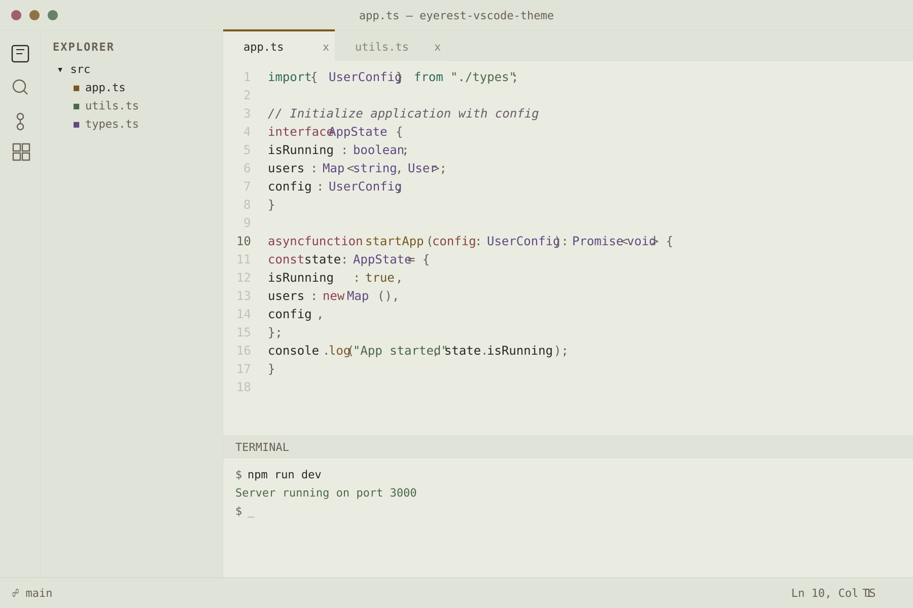
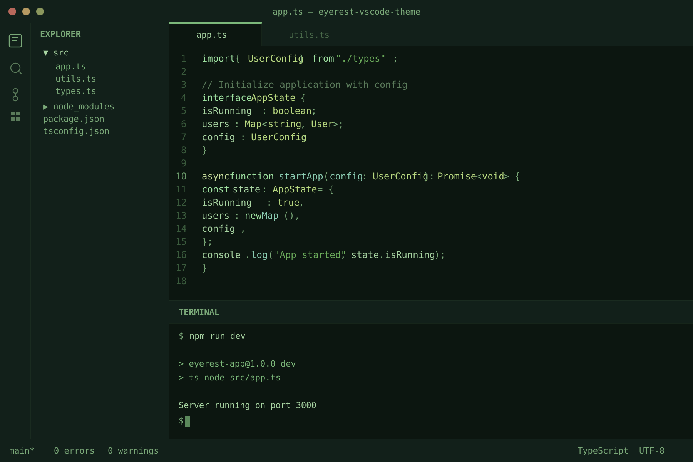
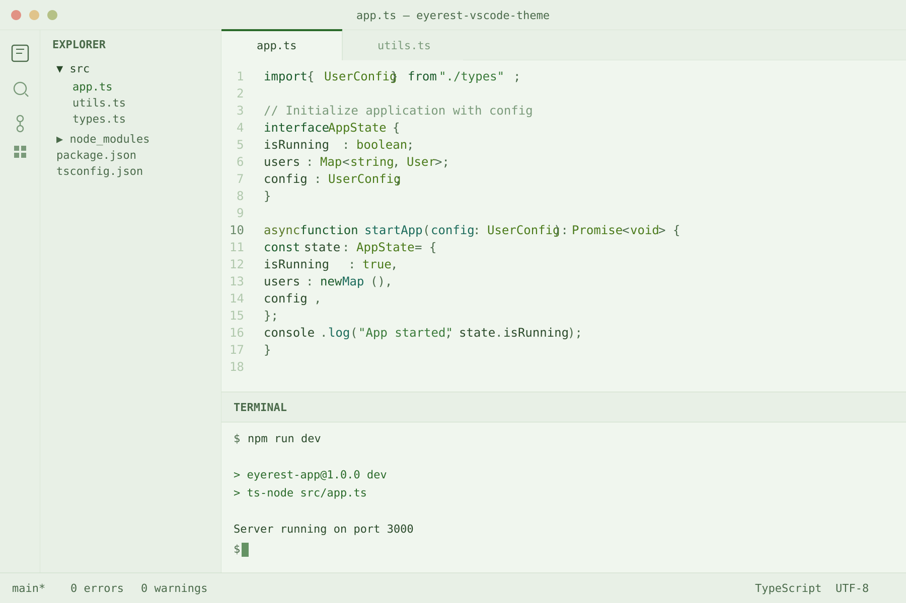
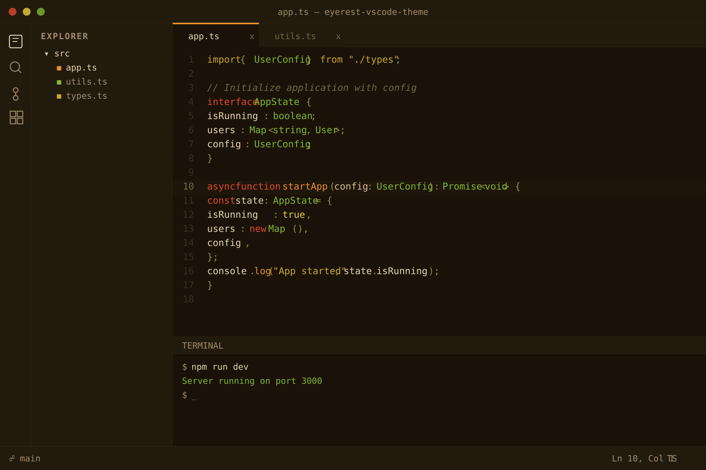
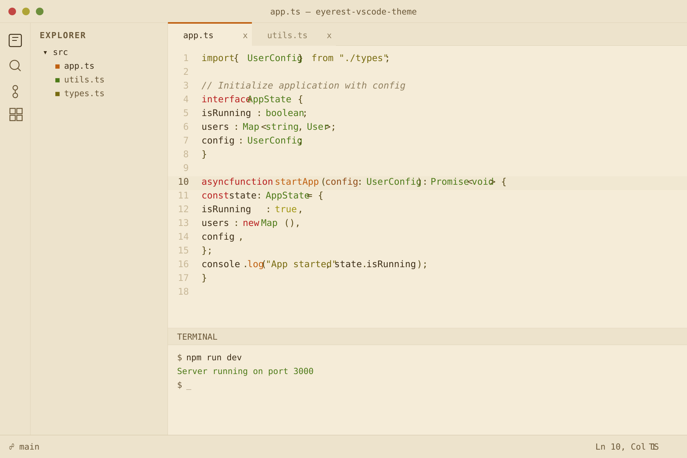

# EyeRest Theme

Eye-friendly VS Code themes for long sessions. Original palettes grounded in color science.

## Variants

| Theme | Background | Text | Best for |
|-------|-----------|------|----------|
| **EyeRest Dark** | Plum-gray `#1F1B22` | Warm cream `#D8CCBC` | Dim rooms |
| **EyeRest Light** | Pale sage `#EAECE2` | Warm charcoal `#2C2622` | Bright rooms |
| **EyeRest Green Dark** | Deep forest `#0C1610` | Green `#A8D4A2` | Dim rooms, green lovers |
| **EyeRest Green Light** | Soft mint `#F0F6EE` | Dark green `#2A4A2A` | Bright rooms, green lovers |
| **EyeRest Amber Dark** | Warm umber `#1A1208` | Warm cream `#E8D5B0` | Blue-filter goggles, dim rooms |
| **EyeRest Amber Light** | Parchment `#F5ECD8` | Dark brown `#3D2E18` | Blue-filter goggles, bright rooms |

### EyeRest Dark


### EyeRest Light



### EyeRest Green Dark



### EyeRest Green Light



### EyeRest Amber Dark



### EyeRest Amber Light



## Why these colors

- **No pure black/white** — avoids halation and luminance extremes
- **5:1-10:1 contrast** — readable without fatiguing
- **Muted accents** — desaturated tones reduce chromatic eye strain
- **Warm tint** — reduces blue light; plum-gray (dark) and sage (light) are novel base tones not used by mainstream themes
- **Green variants** — green sits at peak human visual sensitivity, requiring the least effort to perceive
- **Amber variants** — zero blue component in every color; all syntax remains distinguishable through 100% blue-blocking amber lenses
- **Semantic highlighting** — full LSP token support

## Install

```bash
# From marketplace
ext install qte77.eyerest-vscode-theme

# From .vsix
code --install-extension eyerest-vscode-theme-0.1.0.vsix
```

Then `Ctrl+K Ctrl+T` to pick a variant.

## License

[Apache-2.0](LICENSE)
