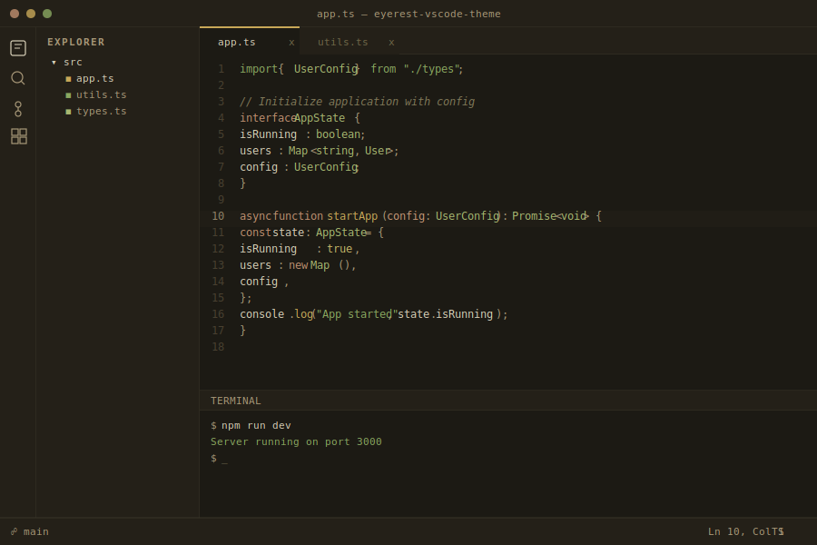
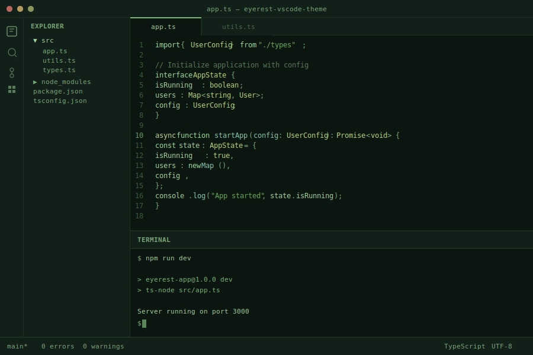
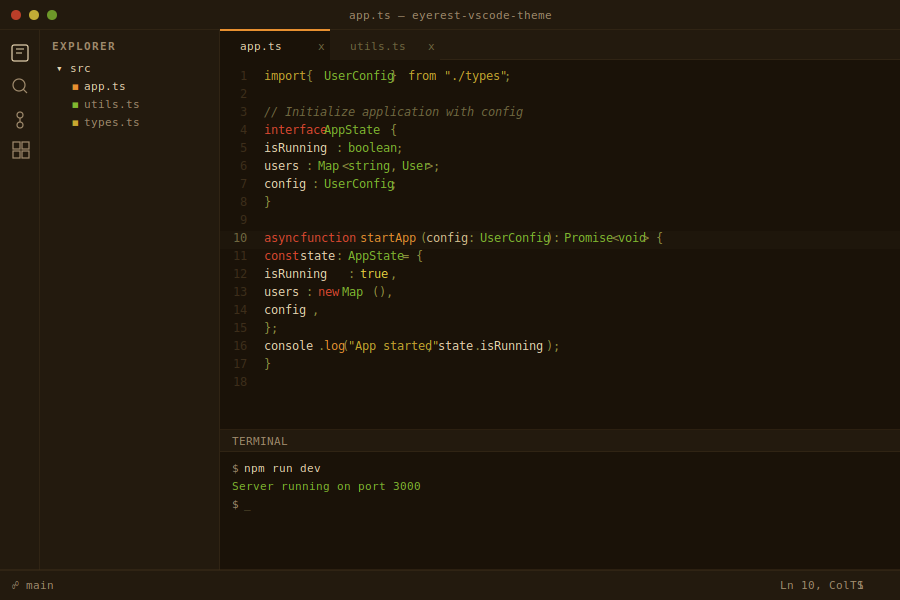
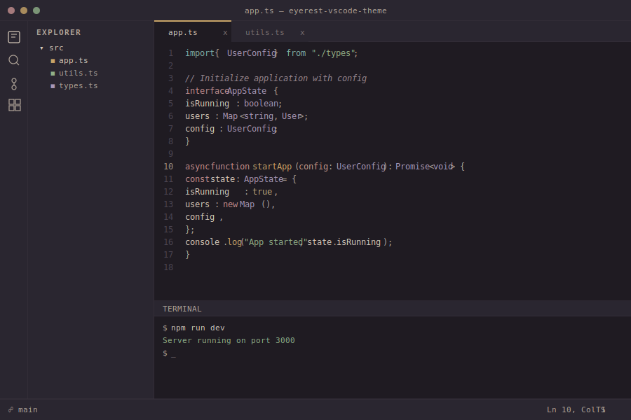

# EyeRest Theme

Eye-friendly VS Code themes for long sessions. Original palettes grounded in color science. Zero blue light in all accent colors.

## Install

```bash
# From marketplace
ext install qte77.eyerest-vscode-theme

# From .vsix
code --install-extension eyerest-vscode-theme-0.1.0.vsix
```

## Variants

| Theme | Background | Text | Use case |
|-------|-----------|------|----------|
| **EyeRest Dark** | Warm umber `#1C1A14` | Yellow cream `#D8D0B8` | General, dim rooms |
| **EyeRest Light** | Warm parchment `#ECE8D8` | Dark brown `#2C2818` | General, bright rooms |
| **EyeRest Green Dark** | Deep forest `#0C1610` | Green `#A8D4A2` | Green lovers |
| **EyeRest Green Light** | Yellow-green `#EEF0E0` | Dark green `#2A4A2A` | Green lovers, bright rooms |
| **EyeRest BluBlock Dark** | Deep umber `#1A1208` | Warm cream `#E8D5B0` | Blue-filter goggles |
| **EyeRest BluBlock Light** | Parchment `#F5ECD8` | Dark brown `#3D2E18` | Blue-filter goggles |
| **EyeRest Dusk Dark** | Plum-gray `#1F1B22` | Warm cream `#D8CCBC` | Earth-tone accents |
| **EyeRest Dusk Light** | Pale sage `#EAECE2` | Warm charcoal `#2C2622` | Earth-tone accents |

<details>
  <summary>EyeRest Dark / Light — warm umber and parchment</summary>
  
</details>

<details>
  <summary>EyeRest Green Dark / Light — deep forest and yellow-green</summary>
  
</details>

<details>
  <summary>EyeRest BluBlock Dark / Light — deep umber and parchment</summary>
  
</details>

<details>
  <summary>EyeRest Dusk Dark / Light — plum-gray and pale sage</summary>
  
</details>

## Design Principles

- **Zero blue in accents** — blue focuses ~1D in front of the retina (chromatic aberration), stimulates the slowest cone pathway, and disrupts circadian rhythm via melanopsin (peak 480nm)
- **Yellow-green-amber accent arc** — yellow text causes least visual fatigue (Fan et al. 2024); green sits at peak photopic sensitivity (555nm)
- **Desaturated tones** — saturated colors fatigue color-opponent channels (L-M, S-(L+M)); muted variants reduce chromatic adaptation
- **No pure black/white** — avoids halation and APCA contrast miscalculation for dark pairs
- **Contrast 5:1-10:1** — above WCAG AA minimum, below fatigue-inducing extremes
- **BluBlock variants** — zero blue component (B<=30 RGB) in every color; all syntax remains distinguishable through 100% amber lenses
- **Dusk variants** — earth-tone accents (dusty rose, sage, amber, lavender, teal) on plum-gray/sage backgrounds
- **Semantic highlighting** — full LSP token support

## Sources

- Fan, Xie et al. (2024) "Effect of Ambient Illumination and Text Color on Visual Fatigue under Negative Polarity" *Sensors* 24(11) — [PMC11175232](https://pmc.ncbi.nlm.nih.gov/articles/PMC11175232/)
- Frontiers in Psychology (2025) "Light green background enhances reading performance in VDT tasks" — [doi:10.3389/fpsyg.2025.1627013](https://www.frontiersin.org/journals/psychology/articles/10.3389/fpsyg.2025.1627013/full)
- Piepenbrock et al. (2013) "Positive display polarity is advantageous for both younger and older adults" *Ergonomics* 56(7) — [PubMed 23654206](https://pubmed.ncbi.nlm.nih.gov/23654206/)
- Sheppard & Wolffsohn (2018) "Digital eye strain: prevalence, measurement and amelioration" *BMJ Open Ophthalmology* 3 — [PMC6020759](https://pmc.ncbi.nlm.nih.gov/articles/PMC6020759/)
- Spitschan et al. (2023) "Effects of calibrated blue-yellow changes in light on the human circadian clock" *Nature Human Behaviour* — [doi:10.1038/s41562-023-01791-7](https://www.nature.com/articles/s41562-023-01791-7)
- Somers, A. "APCA Accessible Perceptual Contrast Algorithm" (WCAG 3.0 candidate) — [APCA docs](https://git.apcacontrast.com/documentation/WhyAPCA.html)

Then `Ctrl+K Ctrl+T` to pick a variant.

## License

[Apache-2.0](LICENSE)
